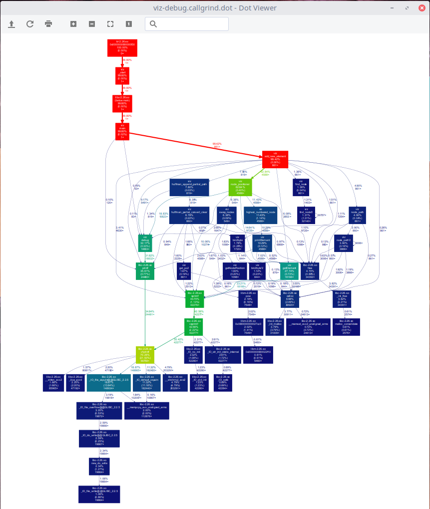

# algoritmi-fgk-compression
  
A C compressor, based on Adaptive Huffman Coding (FGK)

## Requirements
The project itself doesn't require anything more than `gcc`, but some of the make targets (like massif, valgrind, callgrind) require the following debugging tools.  

### Debugging tools
- Valgrind
- Python
- xdot

### Documentation generator
- Pandoc

## Compilation
VIZ can be compiled with the following command:  
```
make
```
The output will be a `viz` binary, that can be called with `./viz`.

## Make Targets

### all
Compiles the `debug` version of Viz (`viz`).

### release
Compiles a release version (optimized, with no debugging symbols and no debugging messages). The output file is named `viz-release`.

### test
Performs the tests specified in the main.c file. When they fail, the make build will fail to have a better integration w/ Jenkins.

### debug
Generates a debugging version of viz compressor. This version won't be optimized, but it will include all the debugging symbols needed in case of problems. Watch out, the debugging mode is *really* verbose. You have been warned.

### massif
This target compiles the debug version of Viz, and creates a `viz.massif` file that is then automatically opened with `massif-visualizer`.


### massif_test
Same as `massif`, but tested against the `viz-test` binary (with no arguments)

### massif_prod
Same as `massif` but tested against the `viz-release` binary. The debug arguments are used.

### valgrind
Performs a Valgrind check on the `debug` binary.

### callgrind
Generates a `viz-debug.callgrind` file of `viz` (debug).  
After the file is generated, it is converted with `python utilities/gprof2dot/gprof2dot.py` to a `.dot` file that is then automatically visualized with `xdot`.  


### callgrind_release
Same as `callgrind`, but using the `viz-release` binary

### callgrind_alice
Does the same as `callgrind` but uses the `DEBUG_ARGS_ALICE` arguments instead (it does compress the `test/files/provided/alice.txt`)

### callgrind_alice_release
Same as `callgrind_alice` but, uses the `viz-release` binary.

### docs
Builds the documentation. The generated artifacts are then written to docs/{readme,documentation}.pdf

### clean
Performs a cleanup of the directory (warning: *.viz files are removed too!)


## Compression
Compression is performed with `viz -c output-file.viz input-file`, where `input-file` can be either a file or a directory.

## Decompression
You can decompress a `.viz` file with `viz -d input-file.viz`.


## Usage
```
VIZ compressor v0.0.1 (dad96c6-dirty)
Compress:        viz -c output.viz inputfile
Extract:         viz -d input.viz
```

## Roadmap
### October 4, 2017
First commit

### January 19, 2018
Deadline

## Resources
[Adaptive Huffman Coding - FGK - Stringology.org](http://www.stringology.org/DataCompression/fgk/index_en.html)  
[Adaptive Huffman Coding - Wikipedia](https://en.wikipedia.org/wiki/Adaptive_Huffman_coding)  
[Adaptive Huffman Coding - The Data Compression Guide](https://sites.google.com/site/datacompressionguide/fgk)  
[Adaptive Huffman Coding - cs.duke.edu](https://www.cs.duke.edu/csed/curious/compression/adaptivehuff.html)  
[Visualizing Adaptive Huffman Coding - Ben Tanen](http://ben-tanen.com/adaptive-huffman/)  
[Array Implementation for Complete Binary Trees](http://www.ida.liu.se/opendsa/OpenDSA/Books/OpenDSA/html/CompleteTree.html)