# Struttura del codice sorgente  

## Introduzione

### Progetto  
Il presente progetto è stato sviluppato presso la Scuola Universitaria della Svizzera Italiana ([SUPSI](http://supsi.ch/)) quale progetto semestrale del corso di *Algoritmi e Strutture Dati (C02008)*.  

#### Specifiche
Le specifiche da rispettare sono le seguenti:

    I progetti sono svolti a gruppi di 2 studenti. Il contributo di ogni
    studente deve essere chiaramente identificato sia nel codice che
    nelle presentazioni (Studente A, Studente B).
    Ogni progetto ha una fase di analisi e una realizzativa. La fase di
    analisi comprende lo studio di documentazione, una fase esplorativa
    dove diverse soluzioni vengono abbozzate e messe a confronto, e la
    selezione delle soluzioni definitive.
    Il programma deve essere scritto in C standard ISO/IEC 9899:1999.
    Nessun estensione particolare del linguaggio è consentita.
    L’implementazione deve essere verificabile. Il programma DEVE sia
    comprimere che decomprimere in due operazioni ben distinte.
##### Esecuzione del programma
    Il programma deve essere invocabile da linea di commando con la
    seguente sintassi:  
    programma opzioni file-input file-output
    dove opzioni deve essere:
    -c
    per comprimere
    -d
    per decomprimere.
    Altre opzioni sono permesse,
    ma non devono essere necessarie per l’esecuzione del programma.
    Una volta lanciato, il programma non deve necessitare più nessuna
    interazione con l’utente.  
    Il programma verrà testato in Linux nel modo seguente:
    programma –c file.input out.compresso
    programma –d out.compresso file.decompresso
    diff file.input file.decompresso
### Autori
Il codice e la documentazione, sono stati realizzati nel periodo 2017-2018 da Cristian Spozio e [Denys Vitali](https://denv.it/).


### Algoritmo
Il progetto si basa sull'algoritmo di Huffman Adattivo (FGK - Faller-Gallager-Knuth).  
Questo algoritmo si distingue dal Huffman "statico" in quanto l'albero viene generato dinamicamente con l'arrivo di nuovi byte.  
  
Grazie alla dinamicità dell'algoritmo è possibile implementare una compressione di uno stream di dati, senza conoscerne a priori il suo totale contenuto (stream video, audio o dati).  
  
Lo scopo dell'algoritmo è (ovviamente) quello di ridurre la quantità di dati da trasmettere / salvare, sfruttando le ripetizioni di byte.  
L'algoritmo risulta essere molto efficiente nella compressione di file con molte ripetizioni (come ad esempio testo), mentre risulta essere poco performante quando i dati hanno un alta entropia.  
  
L'algoritmo si basa sulla proprietà di fratellanza. L'albero generato dovrà sempre rispettare queste due condizioni:  
  
1. Tutti i nodi dell'albero, ad eccezione della radice, devono avere un fratello.
2. I nodi possono essere elencati, da sinistra a destra e dal basso verso l'alto, in ordine di peso.  

In questo esempio mostriamo un albero creato dalla codifica della parola "foobar". 
  
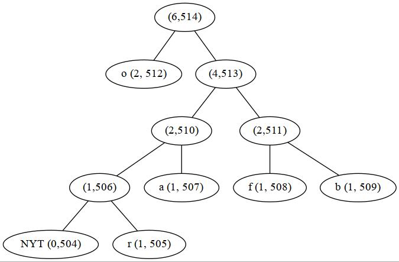

L'albero viene creato a partire da un nodo chiamato NYT (Not-Yet-Translated, "non ancora tradotto") di peso nullo.  
Questo nodo è estremamente utile in quanto nella fase di codifica e decodifica il suo percorso (nell'esempio 1000, ossia Radice -> Destra -> Sinistra -> Sinistra -> Sinistra) ci indicherà che i prossimi 8 bit saranno quelli di un nuovo carattere.  
  
#### Creazione di un albero
L'algoritmo comincia con un albero iniziale contenente un solo nodo, il NYT.   
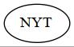{ width=100px } 
  
All'arrivo di un nuovo carattere (per esempio "a"), il compressore verifica se questo è già presente nell'albero. In caso contrario fa nascere dal NYT un sottoalbero con a sinistra il nuovo NYT ed a destra il nuovo elemento, come in figura.

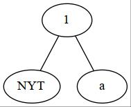{ width=100px } 
  
Essendo la proprietà di fratellanza rispettata, possiamo procedere all'aggiunta di elementi successivi.  
All'arrivo di un'altro carattere (per esempio "b"), il compressore riesegue il controllo di esistenza e fa nascere un nuovo sottoalbero dal NYT precedente.  

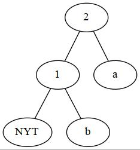{ width=100px } 

Anche in questo caso, prima dell'aggiornamento dei pesi non è necessario effettuare nessuno scambio in quanto la proprietà di fratellanza è rispettata.  
  
All'arrivo di un terzo carattere ("c"), la situazione cambia.  
  
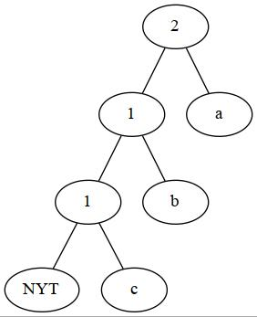{ width=200px }  
  
In questo caso il nodo interno che in precedenza aveva peso 1 deve essere scambiato con "a" in quanto questo incrementerà di valore ed andrà a rompere la proprietà di fratellanza.
  
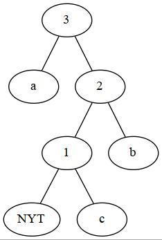{ width=150px }  
  
La proprietà di fratellanza è così rispettata, ed il compressore può quindi continuare a creare l'albero in modo dinamico.


#### Codifica
Durante l'aggiunta degli elementi nell'albero, il compressore prepara i dati da inviare. All'arrivo di un nuovo byte viene inviato il percorso del NYT (nell'ultimo albero 100), e gli 8 bit del byte. Nel caso in cui l'elemento è già stato visto, viene inviata la sua posizione nell'albero, facendo così risparmiare molti bit in caso di ripetizioni continue (ad esempio, per rappresentare "a" ci basterà inviare "0").  
  
Al termine della compressione, nel caso in cui il byte non è completato (lavorando con i bit potrebbe capitarci di non avere un bitstream che è divisibile per 8), la nostra implementazione invia il percorso del NYT, ma dato che gli 8 bit successivi non esistono (perché appunto lo stream termina), il decompressore capirà che il suo lavoro è terminato.

#### Decodifica
La decodifica funziona in modo pressoché identico: all'arrivo di un nuovo byte, questo viene analizzato ed i percorsi presenti sotto forma di bit vengono verificati con l'albero del decompressore. All'arrivo del percorso del NYT, il decompressore si occupa di interpretare i prossimi 8 bit come un byte, e procede quindi all'aggiunta nel suo albero dell'elemento ed all'output su file dello stesso.  
Nel caso in cui il percorso verificato non è quello del NYT, il decompressore aggiunge l'elemento ottenuto dal percorso all'albero e manda in output il carattere associato.  
  
In questo modo, compressore e decompressore hanno sempre il medesimo albero, e possono quindi condividersi percorsi brevi per rappresentare byte frequenti.  

#### Ulteriori informazioni
Purtroppo l'algoritmo non è ben documentato, non esistono RFC o documenti che lo descrivono in modo ottimale ed in rete è presente molto poco a riguardo. Esiste però una visualizzazione grafica molto ben realizzata che vale la pena di consultare: [Visualizing Adaptive Huffman Coding, di Ben Tanen - COMP-150](http://ben-tanen.com/adaptive-huffman/).  
Con l'ausilio di una visualizzazione grafica dell'algoritmo, questo diventa di facile comprensione e può dunque essere sviluppato in maniera più efficace.  
  
### Licenza

MIT License
Copyright (c) <2017-2018> <C.Spozio, D.Vitali>

Permission is hereby granted, free of charge, to any person obtaining a copy of this software and associated documentation files (the "Software"), to deal in the Software without restriction, including without limitation the rights to use, copy, modify, merge, publish, distribute, sublicense, and/or sell copies of the Software, and to permit persons to whom the Software is furnished to do so, subject to the following conditions:

The above copyright notice and this permission notice shall be included in all copies or substantial portions of the Software.

THE SOFTWARE IS PROVIDED "AS IS", WITHOUT WARRANTY OF ANY KIND, EXPRESS OR IMPLIED, INCLUDING BUT NOT LIMITED TO THE WARRANTIES OF MERCHANTABILITY, FITNESS FOR A PARTICULAR PURPOSE AND NONINFRINGEMENT. IN NO EVENT SHALL THE AUTHORS OR COPYRIGHT HOLDERS BE LIABLE FOR ANY CLAIM, DAMAGES OR OTHER LIABILITY, WHETHER IN AN ACTION OF CONTRACT, TORT OR OTHERWISE, ARISING FROM, OUT OF OR IN CONNECTION WITH THE SOFTWARE OR THE USE OR OTHER DEALINGS IN THE SOFTWARE.


## Suddivisione dei file  
  
La scelta che è stata fatta per la suddivisione dei file è stata quella di avere:  
- 1 file per la definizione della licenza: LICENSE  
- 1 file per la gestione dei test: minunit.h  
- 2 file per la gestione della compilazione: Makefile e defines.h  
- 3 file per la gestione della stampa e lo stile di essa: colors.h e console.h/c  
- 5 file per codifica e decodifica di Huffman Adattivo: huffman.h/c, main.c, utilities.h/c  

## Scopo di ogni file  

### LICENSE

*LICENSE* è un file di testo nel quale viene semplicemente definita la licenza del software.

### minunit.h

*minunit.h* è un minimal unit testing framework basato su [MinUnit](http://www.jera.com/techinfo/jtns/jtn002.html). Si differenzia dall'originale semplicemente per l'integrazione di tags per i test.  
Il file contiene le seguenti funzioni:
* mu_assert
* mu_run_test
* mu_tag 

che sono ripettivamente le funzioni di messaggio, esecuzione ed etichettamento dei test.

### Makefile
*Makefile* è un file necessario per semplificare la compilazione del codice.

### defines.h
*defines.h* è un header file contenente vari flags necessari alla compilazione del codice quali DEBUG / TEST / RELEASE mode, versione, fallback per commit versioning. Sono inoltre presenti scelte arbitrarie di progetto (come il NYT number ed il Magic Number).

### colors.h
*colors.h* è un header file che definisce stile e colori da utilizzare nella stampa.

### console.{c,h}
*colors.h* e *colors.c* sono rispettivamente header file e file di codice contenenti definizioni delle funzioni di stampa a video presenti nel codice.

### huffman.{c,h}
*huffman.h* e *huffman.c* sono rispettivamente header file e file di codice contenenti definizioni delle funzione atte alla gestione dell'albero presente nell'algoritmo.

### main.c
*main.c* è il file principale dove sono definite e implementate le funzioni contenenti le operazioni quali lettura e scrittura su file.

### utilities.{c,h}
*utilities.h* e *utilities.c* sono rispettivamente header file e file di codice contenenti funzioni di varia utilità utilizzate nel progetto.

# Strutture dati utilizzate

## Node

*Node* è una `struct` definita come segue:
```c
typedef struct Node{    
    int node_number;
    int weight;
    int element;
    struct Node* left;
    struct Node* right;
    struct Node* parent;
} Node;
``` 
La quale identifica ogni nodo dell'albero con i rispettivi attributi (*node_number*, *weight* e *element*).
Sono inoltre presenti i puntatori ai vari nodi limitrofi quali il *parent* e i *child*  

## HuffmanTree  

*HuffmanTree* è una `struct` definita come segue:
```c
typedef struct{
    Node* root;
    Node* tree[HUFFMAN_ARRAY_SIZE]; // 514
    Node* nyt;

    char* output;
    int output_length;

    char* partial_output;
    int partial_output_length;

    int elements;
    unsigned int mode;
    unsigned char mask;
    unsigned short decoder_last_chunk;
    int decoder_byte;
    int buffer;
} HuffmanTree;
``` 
La quale identifica l'albero con i suoi attributi (*root* e *nyt*).
Contiene inoltre un *array* utilizzato per avere un accesso più veloce ai nodi dell'albero ed il rispettivo numero (*tree* ed *elements*).
Le componenti: *output*, *partial_output* ,*output_length*, *partial_output_length* sono necessarie per le stampe su file e a video.  

Il campo *mode* è necessario in quanto alcune delle funzioni ausiliarie (come per esempio `add_new_element`) hanno comportamenti differenti in caso di compressione o decompressione.  
La componente *mask* è utilizzata per scrivere i byte bit per bit.

# Istruzioni per l'utilizzo  

## Compilazione  

*Nota: Per maggiori opzioni di compilazione, consultare il file README.md presente nella root del progetto*  

Per compilare il progetto è sufficiente utilizzare il comando:
```
make release
```
Verrà così generata la versione di release (senza debugging symbols ed ottimizzata), dal nome `viz-release`.  
Per altri target (come `debug` o `test` si consulti il README.md)  

## Esecuzione  

### Compressione  
La sintassi di compressione è la seguente:  
```
./viz-release -c input output.viz
```
dove l'argomento `-c` serve per eseguire il programma in compressione, `input` è un file di input con una qualsiasi estensione e `output.viz` è il nome del file che si vorrà avere in output.  
È inoltre possibile specificare il flag `-f` per forzare la sovrascrittura del file `output.viz` nel caso in cui questo sia già presente.  
    
**Nota:** È *consigliato* (ma non necessario) mantenere l'estensione `.viz` per riconoscere visualmente quali file sono stati compressi.  
   
**Nota 2:** La sintassi di compressione è stata **imposta** dai requisiti del progetto. Questa sintassi è opposta alla sintassi classica di *qualsiasi altro compressore* presente in UNIX. Per ripristinare il comportamento e mantenere la consistenza che UNIX necessita, si setti il flag `INVERTED_COMPRESSION_FLAG` in `defines.h` a `0`.

### Decompressione  
La sintessi per la decompressione è invece la seguente:  
```
./viz-release -d input.viz
```  
dove l'argomento `-d` serve per eseguire il programma in decompressione e `input.viz` è il file di input (generato precedentemente con il flag `-c`) da decomprimere.
<!--
<div align="center">


# Y'all mind if I praise the Lord?
</div>
-->


# Performance

## Velocità

| Nome file                                     | Dim (kB) | Dim compr. (kB) | Comp. rate | C [s] | D [s] | C [kB/s] | D [kB/s] | 
|-----------------------------------------------|-----------------|----------------|-----------------------|--------------------|----------------------|-------------------|---------------------| 
| bible.txt                                     | 4347            | 2518           | -72.67%               | 7.15               | 7.68                 | 608.0             | 566.0               | 
| adaptivehuffman.txt                           | 8               | 5              | -64.80%               | 0.02               | 0.02                 | 377.5             | 377.5               | 
| 100000.txt                                    | 575             | 256            | -124.91%              | 0.51               | 0.6                  | 1127.6            | 958.5               | 
| sinusoide.txt                                 | 6               | 4              | -52.48%               | 0.02               | 0.02                 | 304.7             | 304.7               | 
| immagine.tiff                                 | 3274            | 3170           | -3.29%                | 3.85               | 3.83                 | 850.5             | 854.9               | 
| alice.txt                                     | 164             | 96             | -70.50%               | 0.3                | 0.32                 | 545.3             | 511.2               | 
| 32k_random                                    | 32              | 32             | 0.05%                 | 0.28               | 0.12                 | 114.3             | 266.7               | 
| 32k_ff                                        | 32              | 4              | -697.47%              | 0.01               | 0.02                 | 3200.0            | 1600.0              | 
| It Is Wednesday My Dudes.mp4 | 703             | 703            | 0.01%                 | 1.2                | 0.72                 | 585.8             | 976.3               | 
| 04.bin                                        | 1024            | 1024           | 0.00%                 | 7.25               | 3.71                 | 141.2             | 276.0               | 
| denys.gif                                     | 25825           | 25646          | -0.70%                | 29.63              | 31.1                 | 871.6             | 830.4               | 

Table: Compressione e Decompressione a confronto  
  
### Spiegazione
L'algoritmo risulta essere molto efficiente nel caso di file lunghi e con molte ripetizioni. Questa condizione è spesso verificata in file testuali, file bitmap oppure in sequenze di numeri.  
Sfortuanatamente il rateo di compressione non è proprio soddisfacente nel caso in cui il file ha un alta entropia (ossia le sue frequenze sono pressoché uniformi). 
  
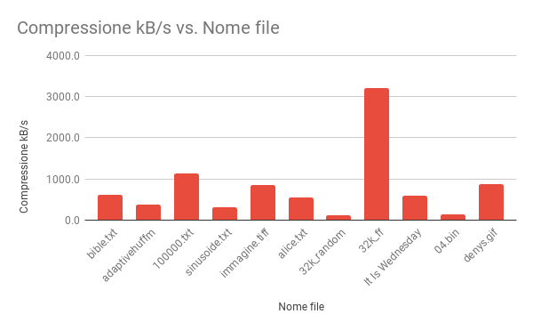
  
  


## Consumo di memoria
### Compressione
Il compressore ha un consumo di memoria lineare di circa 47KiB, indipendente dalla dimensione del file.  
Nell'esempio qui sotto è stata compressa un immagine da 2MB tramite il comando `make massif_release_intense_c`.  
  


### Decompressione
Il decompressore ha un consumo di memoria lineare, intorno ai 100KiB per qualsiasi tipo di file.  
Nell'esempio qui sotto è stata utilizzata un file compresso di 2MB. L'esempio è riproducibile su un qualisasi altro sistema con il comando `make massif_release_intense_d`.
  
  
  

# Procedure di test e problemi noti   

## Problemi noti
### Efficienza dell'algoritmo
Come menzionato precedentemente, l'algoritmo non sembra essere molto efficiente nel comprimere qualsiasi tipo di file. È quindi sconsigliabile quale general-purpose compressor. Il compressore è però molto efficace in caso di documenti strutturati (come per esempio file SVG / HTML / JSON) oppure in documenti testuali (libri o estratti di pagine web).

### Compressione "lenta"
Nonostante il nostro algoritmo possa vantare di una velocità di compressione di circa 800 kB/s [^1], questo risultato non è ottimale. Con un maggiore lavoro di code optimization è sicuro possibile sfiorare la soglia di 1 MB/s.

[^1]: Intel Core i7-6700HQ @ 8x 3.5GHz, 32GB RAM, x86_64 Linux 4.14.13-1, Spectre patch applied.

## Test effettuati  
### test_debug  
Testa se il software è in modalità `DEBUG`.

### test_create_huffman_tree  
Testa se la funzione `create_huffman_tree` viene eseguita correttamente.

### test_swap_ht_array  
Testa la funzione `swap_nodes` e confronta il risultato con quello aspettato.

### test_get_node_level
Testa la funzione `getNodeLevel` e confronta il risultato con quello aspettato.  

### test_simple_swap
Testa la funzione `swap_node` applicandola ad un esempio semplice e confronta il risultato con quello aspettato.  

### test_swap_nodes
Testa la funzione `swap_node` in tutte le sue funzioni e confronta il risultato con quello aspettato.  

### test_node_path
Testa la funzione `node_path` e confronta il risultato con quello aspettato.

### test_huffman_coding  
Testa se la codifica di Huffman viene eseguita correttamente

### test_huffman_coding_abracadabra
Il test si assicura che l'albero generato dalla codifica di "abracadabra" corrisponda a quello aspettato.  

### test_huffman_coding_abcbaaa
Il test si assicura che l'albero generato dalla codifica di "abcbaaa" corrisponda a quello aspettato.  

### test_huffman_coding_bookkeeper
Il test si assicura che l'albero generato dalla codifica di "bookkeeper" corrisponda a quello aspettato.  

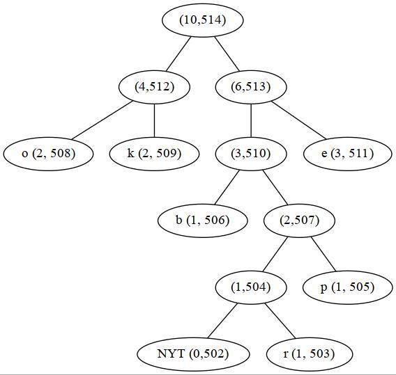  
  

### test_huffman_coding_mississippi
Il test si assicura che l'albero generato dalla codifica di "mississippi" corrisponda a quello aspettato.  
  
  
  

### test_huffman_coding_engineering
Il test si assicura che l'albero generato dalla codifica di "engineering" corrisponda a quello aspettato.  
  
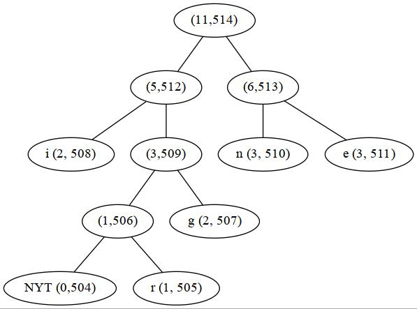  
  

### test_huffman_coding_foobar
Il test si assicura che l'albero generato dalla codifica di "foobar" corrisponda a quello aspettato.  
  
  
  

### test_huffman_coding_aardvark
Il test si assicura che l'albero generato dalla codifica di "aardvark" corrisponda a quello aspettato.  
  
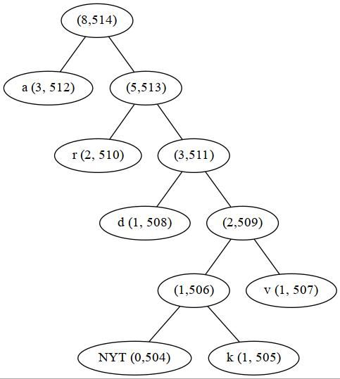  


### test_huffman_coding_sleeplessness
Il test si assicura che l'albero generato dalla codifica di "sleeplessness" corrisponda a quello aspettato.  
  
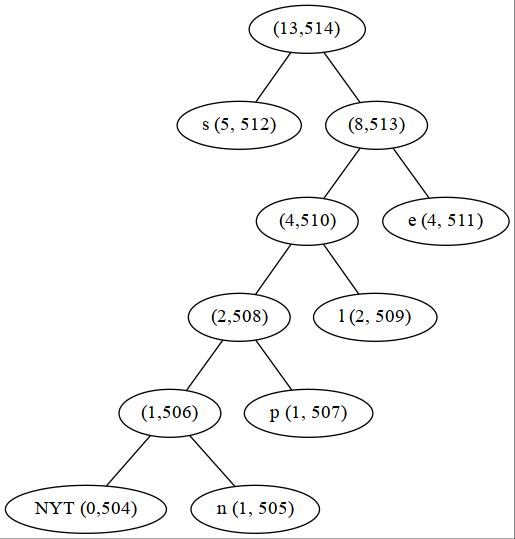  


### test_bin2byte
Testa la funzione bin2byte che converte una stringa di 0 ed 1 in un byte.

### test_bin2byte2
Estende il test di bin2byte per casi più complessi.

### test_byte2bin
Testa la funzione byte2bin che converte dei byte in una stringa di 0 ed 1.

### test_filename
Testa la funzione `get_filename(char* filepath)`.

### test_create_file
Testa la funzione di creazione di file

### test_write_to_file
Testa la funzionalità di scrittura su file

### test_read_file
Testa la lettura da file

### test_file_delete
Testa la funzionalità di eliminazione di file
