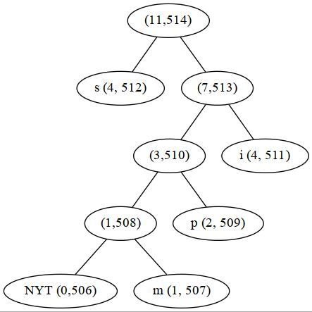

# Struttura del codice sorgente  

## Suddivisione dei file  
  
La scelta che è stata fatta per la suddivisione dei file è stata quella di avere:
* 1 file per la definizione della licenza: LICENSE
* 1 file per la gestione dei test: minunit.h
* 2 file per la gestione della compilazione: Makefile e defines.h
* 3 file per la gestione della stampa e lo stile di essa: colors.h e console.h/c
* 5 file per codifica e decodifica di Huffman Adattivo: huffman.h/c, main.c, utilities.h/c

## Scopo di ogni file  

### LICENSE

*LICENSE* è un file di testo nel quale viene semplicemente definita la licenza del software.

### minunit.h

*minunit.h* è un minimal unit testing framework basato su [MinUnit](http://www.jera.com/techinfo/jtns/jtn002.html). Si differenzia dall'originale semplicemente per l'integrazione di tags per i test.  
Il file contiene le seguenti funzioni:
* mu_assert
* mu_run_test
* mu_tag 

che sono ripettivamente le funzioni di messaggio, esecuzione ed etichettamento dei test.

### Makefile
*Makefile* è un file necessario per semplificare la compilazione del codice.

### defines.h
*defines.h* è un header file contenente vari flags necessari alla compilazione del codice quali DEBUG / TEST / RELEASE mode, versione, fallback per commit versioning. Sono inoltre presenti scelte arbitrarie di progetto (come il NYT number ed il Magic Number).

### colors.h
*colors.h* è un header file che definisce stile e colori da utilizzare nella stampa.

### console.{c,h}
*colors.h* e *colors.c* sono rispettivamente header file e file di codice contenenti definizioni delle funzioni di stampa a video presenti nel codice.

### huffman.{c,h}
*huffman.h* e *huffman.c* sono rispettivamente header file e file di codice contenenti definizioni delle funzione atte alla gestione dell'albero presente nell'algoritmo.

### main.c
*main.c* è il file principale dove sono definite e implementate le funzioni contenenti le operazioni quali lettura e scrittura su file.

### utilities.{c,h}
*utilities.h* e *utilities.c* sono rispettivamente header file e file di codice contenenti funzioni di varia utilità utilizzate nel progetto.

# Strutture dati utilizzate

## Node

*Node* è una `struct` definita come segue:
```c
typedef struct Node{    
    int node_number;
    int weight;
    int element;
    struct Node* left;
    struct Node* right;
    struct Node* parent;
} Node;
``` 
La quale identifica ogni nodo dell'albero con i rispettivi attributi (*node_number*, *weight* e *element*).
Sono inoltre presenti i puntatori ai vari nodi limitrofi quali il *parent* e i *child*  

## HuffmanTree  

*HuffmanTree* è una `struct` definita come segue:
```c
typedef struct{
    Node* root;
    Node* tree[HUFFMAN_ARRAY_SIZE]; // 514
    Node* nyt;

    char* output;
    int output_length;

    char* partial_output;
    int partial_output_length;

    int elements;
    unsigned int mode;
    unsigned char mask;
    unsigned short decoder_last_chunk;
    int decoder_byte;
    int buffer;
} HuffmanTree;
``` 
La quale identifica l'albero con i suoi attributi (*root* e *nyt*).
Contiene inoltre un *array* utilizzato per avere un accesso più veloce ai nodi dell'albero ed il rispettivo numero (*tree* ed *elements*).
Le componenti: *output*, *partial_output* ,*output_length*, *partial_output_length* sono necessarie per le stampe su file e a video.  

Il campo *mode* è necessario in quanto alcune delle funzioni ausiliarie (come per esempio `add_new_element`) hanno comportamenti differenti in caso di compressione o decompressione.  
La componente *mask* è utilizzata per scrivere i byte bit per bit.

# Istruzioni per l'utilizzo  

## Compilazione  

*Nota: Per maggiori opzioni di compilazione, consultare il file README.md presente nella root del progetto*  

Per compilare il progetto è sufficiente utilizzare il comando:
```
make release
```
Verrà così generata la versione di release (senza debugging symbols ed ottimizzata), dal nome `viz-release`.  
Per altri target (come `debug` o `test` si consulti il README.md)  

## Esecuzione  

### Compressione  
La sintassi di compressione è la seguente:  
```
./viz-release -c input output.viz
```
dove l'argomento `-c` serve per eseguire il programma in compressione, `input` è un file di input con una qualsiasi estensione e `output.viz` è il nome del file che si vorrà avere in output.  
È inoltre possibile specificare il flag `-f` per forzare la sovrascrittura del file `output.viz` nel caso in cui questo sia già presente.  
    
**Nota:** È *consigliato* (ma non necessario) mantenere l'estensione `.viz` per riconoscere visualmente quali file sono stati compressi.  
   
**Nota 2:** La sintassi di compressione è stata **imposta** dai requisiti del progetto. Questa sintassi è opposta alla sintassi classica di *qualsiasi altro compressore* presente in UNIX. Per ripristinare il comportamento e mantenere la consistenza che UNIX necessita, si setti il flag `INVERTED_COMPRESSION_FLAG` in `defines.h` a `0`.

### Decompressione  
La sintessi per la decompressione è invece la seguente:  
```
./viz-release -d input.viz
```  
dove l'argomento `-d` serve per eseguire il programma in decompressione e `input.viz` è il file di input (generato precedentemente con il flag `-c`) da decomprimere.
<!--
<div align="center">


# Y'all mind if I praise the Lord?
</div>
-->
  
# Procedure di test e problemi noti   
## Test effettuati  
### test_debug  
Testa se il software è in modalità `DEBUG`.

### test_create_huffman_tree  
Testa se la funzione `create_huffman_tree` viene eseguita correttamente.

### test_swap_ht_array  
Testa la funzione `swap_nodes` e confronta il risultato con quello aspettato.

### test_get_node_level
Testa la funzione `getNodeLevel` e confronta il risultato con quello aspettato.  

### test_simple_swap
Testa la funzione `swap_node` applicandola ad un esempio semplice e confronta il risultato con quello aspettato.  

### test_swap_nodes
Testa la funzione `swap_node` in tutte le sue funzioni e confronta il risultato con quello aspettato.  

### test_node_path
Testa la funzione `node_path` e confronta il risultato con quello aspettato.

### test_huffman_coding  
Testa se la codifica di Huffman viene eseguita correttamente

### test_huffman_coding_abracadabra
Il test si assicura che l'albero generato dalla codifica di "abracadabra" corrisponda a quello aspettato.  

### test_huffman_coding_abcbaaa
Il test si assicura che l'albero generato dalla codifica di "abcbaaa" corrisponda a quello aspettato.  

### test_huffman_coding_bookkeeper
Il test si assicura che l'albero generato dalla codifica di "bookkeeper" corrisponda a quello aspettato.  


### test_huffman_coding_mississippi
Il test si assicura che l'albero generato dalla codifica di "mississippi" corrisponda a quello aspettato.  


### test_huffman_coding_engineering
Il test si assicura che l'albero generato dalla codifica di "engineering" corrisponda a quello aspettato.  


### test_huffman_coding_foobar
Il test si assicura che l'albero generato dalla codifica di "foobar" corrisponda a quello aspettato.  


### test_huffman_coding_aardvark
Il test si assicura che l'albero generato dalla codifica di "aardvark" corrisponda a quello aspettato.  


### test_huffman_coding_sleeplessness
Il test si assicura che l'albero generato dalla codifica di "sleeplessness" corrisponda a quello aspettato.  


### test_bin2byte
Testa la funzione bin2byte che converte una stringa di 0 ed 1 in un byte.

### test_bin2byte2
Estende il test di bin2byte per casi più complessi.

### test_byte2bin
Testa la funzione byte2bin che converte dei byte in una stringa di 0 ed 1.

### test_filename
Testa la funzione `get_filename(char* filepath)`.

### test_create_file
Testa la funzione di creazione di file

### test_write_to_file
Testa la funzionalità di scrittura su file

### test_read_file
Testa la lettura da file

### test_file_delete
Testa la funzionalità di eliminazione di file
