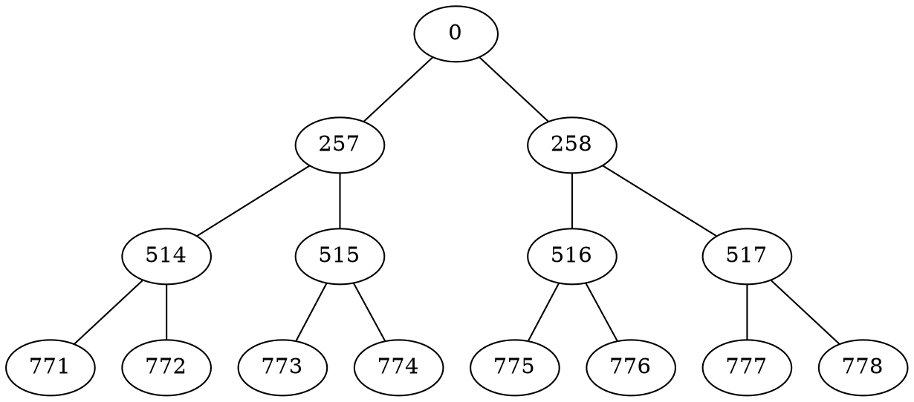

# Nodes positioning logic (for HTA swap)

Assuming `HT_X = 257`


# Graph


```
HTA:
0
257, 258
514, 515, 516, 517
771, 772, 773, 774, 775, 776, 777, 778
```

```

257 = [1][0] = 0 + 257 + 0 + 0
258 = [1][1] = 0 + 257 + 0 + 1

---------------------------------

514 = [2][0] = 257 + 257 + 0 + 0
515 = [2][1] = 257 + 257 + 0 + 1

516 = [2][2] = 258 + 257 + 1 + 0
517 = [2][3] = 258 + 257 + 1 + 1

---------------------------------

771 = [3][0] = 514 + 257 + 0 + 0
772 = [3][1] = 514 + 257 + 0 + 1

773 = [3][2] = 515 + 257 + 1 + 0
774 = [3][3] = 515 + 257 + 1 + 1

775 = [3][4] = 516 + 257 + 2 + 0
776 = [3][5] = 516 + 257 + 2 + 1

777 = [3][6] = 517 + 257 + 3 + 0
778 = [3][7] = 517 + 257 + 3 + 1

---------------------------------

```